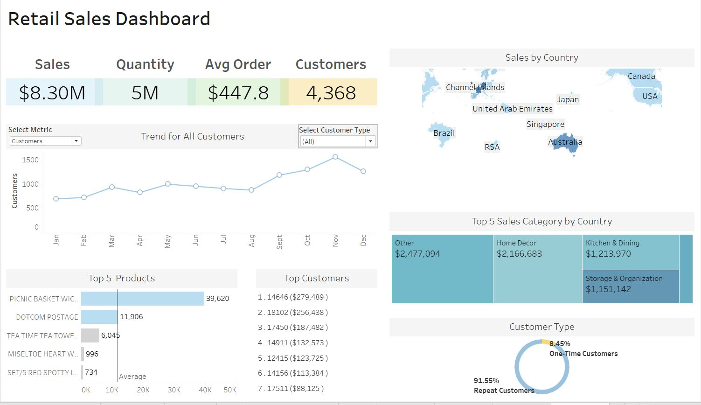

# 🛍️ Retail Sales Performance Dashboard

### Project Overview
This project presents an interactive Tableau dashboard built using the UCI Online Retail Dataset, which contains transactional data for a UK-based online retailer from 2010 and 2011. The dashboard is designed to help stakeholders uncover key business insights around sales performance, customer behavior, and product trends across countries.

### 📁 Dataset
- **Source:** [UCI Machine Learning Repository - Online Retail Data](https://archive.ics.uci.edu/dataset/352/online+retail)
- **Time Frame:** December 2010 – December 2011

### 🛠 Tools Used

- **Excel** - Data Cleaning and Preprocessing
- **Tableau** - Data Visualization

## Data Cleaning/Preparation

The following steps were taken to prepare the dataset:

1. Removed rows nulls in **CustomerID**
2. Filtered out **Quantity <= 0 and UnitPrice <= 0**
3. Filtered out **Unspecified Country**
 
## 🎯 Business Questions Answered

1.	What is the total revenue and quantity sold?
2.	How has revenue changed over time (monthly trend)?
3.	Which countries generate the most revenue?
4.	Which products and categories generate the most revenue?
5.	Who are the top spending customers?
6.	What is the average order value?
7.	How many customers are repeat vs. one-time?
8.	Which product categories perform best by country?

## 🧠 Key Insights

- **$8.30M** in revenue generated by 4,368 customers across 30+ countries
- **91.55%** of customers are repeat buyers
- The **UK** dominates revenue, followed by **Netherlands** and **Ireland**
- Top products are concentrated in Others, home decor and Kitchen & Dining

## 📈 Dashboard Features

- **Interactive filters** for metric and customer type
- **KPIs** for sales, quantity, AOV, customer count
- **Monthly trend line** for user engagement over time
- **Map** visualization of sales by country
- **Treemap** of category-level sales per country
- **Donut chart** for repeat vs. one-time customers
- **Bar charts** for top products and customers

### 📷 Dashboard Preview

### 🔗 Live Dashboard
View the interactive dashboard on Tableau Public:
👉 [Click Here to View on Tableau Public](https://public.tableau.com/views/TableauDashboardTemplate_17463452546110/RetailSalesDashboard?:language=en-US&publish=yes&:sid=&:redirect=auth&:display_count=n&:origin=viz_share_link)

